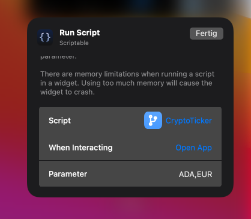

# crypto-ticker-widget.js
A Scriptable widget that shows the current crypto course in fiat currency based on coinbase

 

   <a href="#setup">Setup</a> •
   <a href="#usage">Usage</a> •
   <a href="#links">Links</a> •
   <a href="#contribution">Contribution</a> •
   <a href="todo">TODO</a>
 

## Setup

1. (if not done yet) Download the scriptable app form [AppStore](https://apps.apple.com/de/app/scriptable/id1405459188)
 2. In Scriptable create a new script
 3. Copy the code from script file [crypto-ticker-widget.js](https://github.com/wickenico/crypto-ticker-widget.js/blob/main/crypto-ticker-widget.js)
 4. Create a new widget on homescreen and select this script in scriptable

 ## Usage
- Parameters: Symbol of crypto currency + , + symbol of fiat currency
- Example: ETH,EUR (small and big letters possible)

## Links
Coinbase API: https://developers.coinbase.com/api/v2#get-spot-price

## Contribution

If you have any ideas for extensions or changes just let me know.

## TODO

- Errorhandling for missing json objects
