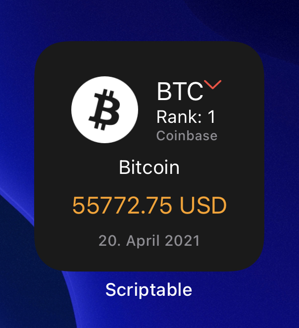
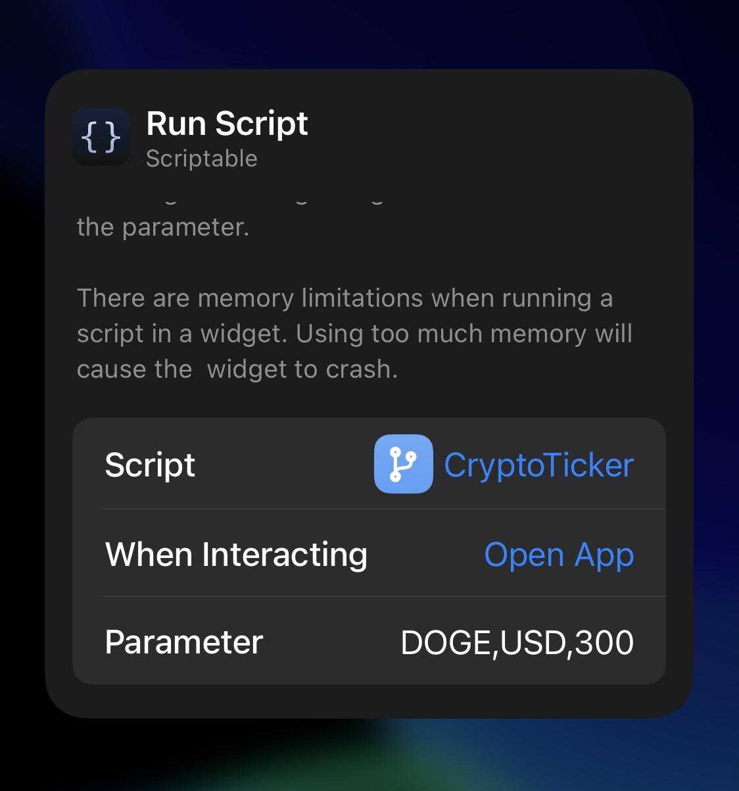
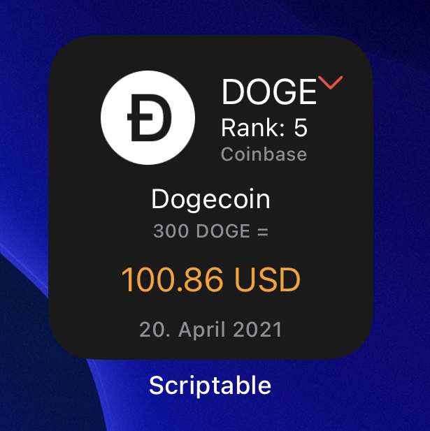

# crypto-ticker-widget.js (v2.0.0)
A Scriptable widget that shows the current crypto course in fiat currency based on coinbase  

(I'm looking for free crypto APIs without any apikey or auth constraint just let me know your favs!)

  
 

 

   <a href="#description">Setup</a> • 
   <a href="#setup">Setup</a> •
   <a href="#usage">Usage</a> •
   <a href="#links">Links</a> •
   <a href="#contribution">Contribution</a> •
   <a href="#todo">TODO</a> •
 

## Description

Meanings in the Widget:
- BTC: Symbol of the cryptocurrency
- Rank: Ranking order by total volume in relation of all cryptocurrencies
- Coinbase: Stock exchange from which the course is obtained (Actually Coinbase or Bitfinex)
- Bitcoin: Whole name of cryptocurrency
- 55772.75 USD: Value of 1 BTC in USD
- 20 April 2021: Today's date

## Setup

1. (if not done yet) Download the scriptable app form [AppStore](https://apps.apple.com/de/app/scriptable/id1405459188)
 2. In Scriptable create a new script
 3. Copy the code from script file [crypto-ticker-widget.js](https://github.com/wickenico/crypto-ticker-widget.js/blob/main/crypto-ticker-widget.js)
 4. Create a new widget on homescreen and select this script in scriptable

 ## Usage
- Parameters separated with ",": 
  - 1. Symbol of crypto currency
  - 2. Symbol of fiat currency
  - 3. Amount of crypto to calculate (Split with "."!)
- Example: DOGE,USD,300 (small and big letters possible)
- The 3rd parameter is set to 1 if it is not passed.
- If there's no picture of the selected available it will be filled with a placeholder image

  

## Links
Coinbase API: https://developers.coinbase.com/api/v2#get-spot-price  
Coinpaprika API: https://api.coinpaprika.com/#tag/Tools/paths/~1search/get  
Bitfinex API: https://docs.bitfinex.com/docs/introduction  

## Contribution

If you have any ideas for extensions or changes just let me know.

## TODO

- DONE: Errorhandling for missing json objects
- DONE: Add up and down symbols
- DONE: Fallback to Bitfinex course
- DONE: New Parameter for a specific amount
- DONE: Update images and description
